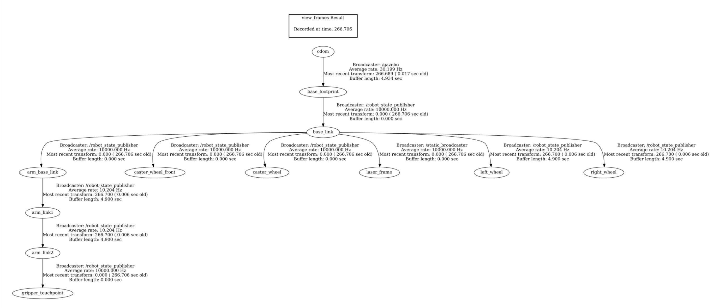

# Warehouse Mobile Manipulator

A complex mobile robot system (Mobile Manipulator) designed to operate in a
simulated warehouse environment, built on ROS1 (Noetic). The robot consists
of a differential-drive mobile base equipped with a LiDAR sensor, and a
2-DOF revolute manipulator (RR arm) mounted on top of the base for pick-up
tasks.

## 1. Project Structure

```
warehouse_mobile_manipulator/
├── CMakeLists.txt
├── package.xml
├── README.md
├── launch/
│   └── bringup_all.launch      # Master launch file for the whole system
├── urdf/
│   └── robot.urdf              # Robot model and sensor definitions
├── worlds/
│   └── warehouse.world         # Gazebo simulation world
├── scripts/
│   ├── tf_listener.py          # Dynamic TF listener node (Python)
│   └── safety_monitor.py       # Obstacle distance safety monitor node
├── src/
│   └── static_broadcaster.cpp  # Static TF broadcaster node (C++)
├── docs/
│   └── rqt_graph.png           # rqt_graph screenshot showing node connections
└── bag/
    └── run_data.bag            # Rosbag recording of a manual driving session
```

## 2. Requirements

- Ubuntu 20.04
- ROS Noetic
- Gazebo (bundled with ROS Noetic)
- ROS packages: `rospy`, `tf2_ros`, `geometry_msgs`, `sensor_msgs`,
  `std_msgs`, `urdf`, `rviz`

## 3. Installation

```bash
mkdir -p ~/warehouse/src
cd ~/warehouse/src
git clone https://github.com/snowy5248-web/warehouse_mobile_manipulator.git
cd ~/warehouse
catkin_make
source devel/setup.bash
```

## 4. Running the System

Launch the entire system (Gazebo, RViz, all nodes, control GUIs) with a
single command:

```bash
roslaunch warehouse_mobile_manipulator bringup_all.launch
```

### Manual Control

- **Driving the mobile base**: use `teleop_twist_keyboard` or the
  `rqt_robot_steering` slider GUI to publish velocity commands to the
  `/cmd_vel` topic.
- **Controlling the arm joints**: use the `joint_state_publisher_gui`
  interface to adjust joint angles and move the `gripper_touchpoint` to
  the target object.

### Safety Monitor Node

The `safety_monitor.py` node subscribes to the `/scan` topic. When the
distance to the nearest obstacle drops below 0.3 m, the terminal displays:

```
WARNING: TOO CLOSE TO OBSTACLE (< 0.3m)
```

### Recording a Rosbag

```bash
rosbag record -O bag/run_data.bag /odom /cmd_vel
```

## 5. TF Tree

```
world/map → odom → base_link → laser_frame
                 → arm_base_link → arm_link1 → arm_link2 → gripper_touchpoint
```

- A **static TF broadcaster** node publishes the fixed transform between
  `laser_frame` and `base_link`.
- A **dynamic TF listener** node continuously computes and prints the
  position (x, y, z) of `gripper_touchpoint` relative to `odom` at 10 Hz.

## 6. Node Graph (rqt_graph)

The diagram below shows the connections between nodes and topics in the
running system, captured with:

```bash
rosrun rqt_graph rqt_graph
```



## 7. Notes

- The robot follows a Mobile Manipulator design: a differential-drive base
  combined with a 2-DOF revolute (RR) arm.
- The full TF tree is maintained continuously from the world frame down to
  the end-effector frame, with no missing links.
